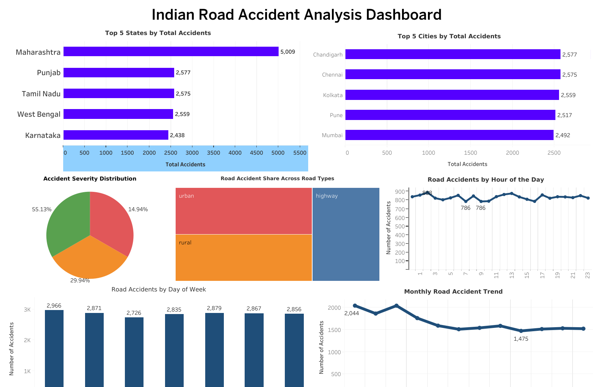

# 🚗 Indian Road Accident Analysis

## 📌 Project Overview

This project analyzes Indian road accident data to identify trends, accident hotspots, severity patterns, weather impacts, traffic conditions, and major causes of accidents.

The project was developed using Python for data analysis and Tableau Public for interactive dashboard creation. It demonstrates an end-to-end data analytics workflow from data cleaning to business insights.

---

## 🎯 Objectives

- Analyze accident trends across Indian states and cities.
- Identify major accident causes.
- Study accident severity distribution.
- Analyze accidents by weather, traffic density, and road type.
- Discover monthly and weekly accident patterns.
- Build an interactive Tableau dashboard for business users.

---

## 🛠️ Tools & Technologies

- Python
- Pandas
- NumPy
- Matplotlib
- Seaborn
- Tableau Public
- Google Colab Notebook

---

## 📂 Dataset Information

- **Dataset Name:** Indian Road Accident Dataset
- **Original Records:** 20,000
- **Cleaned Records:** 20,000
- **Source Format:** Excel (.xlsx)

### Key Features

- State
- City
- Date
- Time
- Weather
- Traffic Density
- Road Type
- Accident Severity
- Risk Score
- Casualties
- Vehicles Involved
- Visibility
- Temperature
- Day of Week
- Peak Hour
- Weekend
- Festival

---

## 📊 Project Workflow

1. Data Collection
2. Data Cleaning & Preprocessing
3. Exploratory Data Analysis (EDA)
4. KPI & Business Analysis
5. Advanced Analytics
6. Data Visualization
7. Tableau Dashboard Development
8. Business Reporting

---

## 📁 Project Structure

```text
Indian_Road_Accident_Analysis/
│
├── data/
├── notebook/
├── dashboard/
├── images/
├── docs/
│
├── README.md
├── requirements.txt
├── LICENSE
└── .gitignore
```

---

## 📈 Dashboard Preview



---

## 📊 Visualizations

- Top 5 States by Total Accidents
- Top 5 Cities by Total Accidents
- Accident Severity Distribution
- Road Accidents by Hour of Day
- Road Accidents by Day of Week
- Monthly Road Accident Trend
- Road Accidents by Weather
- Road Type Treemap
- Traffic Density vs Accident Severity Heatmap
- Accident Risk Quartile
- Pareto Analysis of Accident Causes

---

## 💡 Key Business Insights

- Maharashtra records the highest number of road accidents.
- Distraction and overspeeding are the leading causes of accidents.
- Minor accidents account for more than half of all reported incidents.
- High and low traffic density have similar accident counts.
- January and March recorded the highest monthly accident totals.
- Accident frequency remains relatively consistent throughout the week.
- Weather conditions significantly influence accident occurrence.
- Highway and urban roads contribute a major share of accidents.

---

## ▶️ How to Run

1. Clone this repository.

```bash
git clone https://github.com/AnkanXcoder/Indian_Road_Accident_Analysis.git
```

2. Install dependencies.

```bash
pip install -r requirements.txt
```

3. Open the notebooks using Jupyter Notebook or Google Colab.

4. Open the Tableau dashboard (`.twbx`) using Tableau Public Desktop.

---

## 📄 Reports

- Executive Business Report (PDF)
- Executive Business Report (DOCX)
- Indian Road Accident Analysis Summary

---

## 👤 Author

**Ankan Sen**

B.Tech CSE Student

Aspiring Data Analyst | Machine Learning Enthusiast

---

## ⭐ If you found this project useful, consider giving it a star!